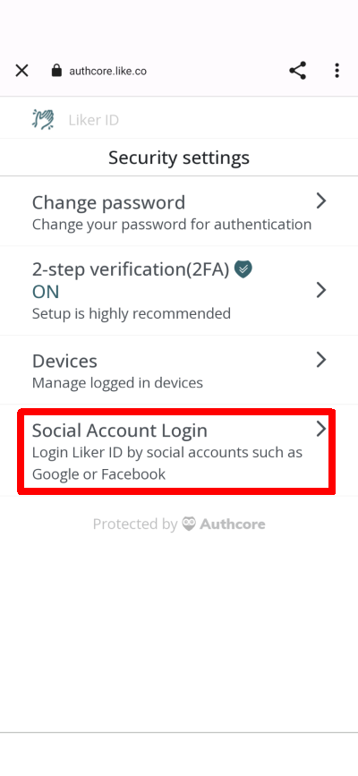
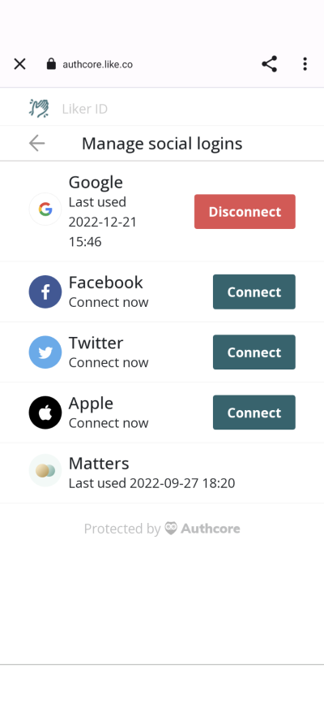
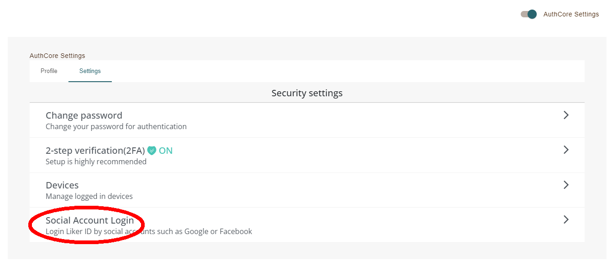

# Connecting to my social account


The followings are for [Liker ID registered through Email/Social (with Authcore)](./).


## Why Link Different Social Account Logins:

There are two benefits to linking your social acount logins:

1. You don't have to input your email address and password; just use your usual social media account to log in.
2. Protect access to your Liker ID: If there is an issue with one of the login methods (e.g., forgetting the password or technical problems with the platform itself), you can still use other social media logins to access your Liker ID.

## Linking Method (Except Matters)

### Mobile

On the [LikeCoin app](../../liker-land/download.md), click on "Settings" at the lower right-hand corner and select "Security", then click "Social Account Login".

<figure><figcaption>
Click "Social Account Login"
</figcaption></figure>

Click on the social media login ( except Matters ), follow the on-screen instructions, and log in to your account.

<figure><figcaption>
Click on the social media login
</figcaption></figure>

### Web

Go to the upper right corner of the [Liker Land website](https://liker.land/en) and click "Login".

<figure><figcaption>
Click "Login"
</figcaption></figure>

Click "Email/Social" using Liker ID by email or social login

<figure><figcaption>
Click Email/Social using Liker ID by email or social login
</figcaption></figure>

After logging in, click on the avatar in the upper right corner, click ‘Settings’, and then click ‘Liker ID’.”

<figure><figcaption>
click "Settings", and then click "Liker ID"
</figcaption></figure>

Click "AuthCore Settings" in the upper right corner.

<figure><figcaption>
Click "AuthCore Settings"
</figcaption></figure>

Click "Security settings" and "Social Account login".

Click on the social media login ( except Matters ), follow the on-screen instructions, and log in to your account.

## **How to link Matters account**

Users have to go to the Matters website for linking:

1. Switch to the English interface on the right-hand corner.
2. Log in to [Matters.town](https://matters.town/).
3. Click on "My Page" on the left-hand side and select "Settings" from the menu.
4. Under "Wallet Settings," select "Liker ID."
5. Log in to your Liker ID and link it with Matters according to the instructions.


Once you link your Liker ID with Matters ID, they cannot be unbound.

